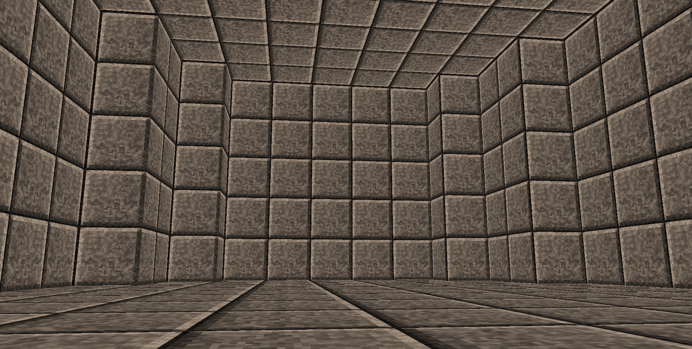
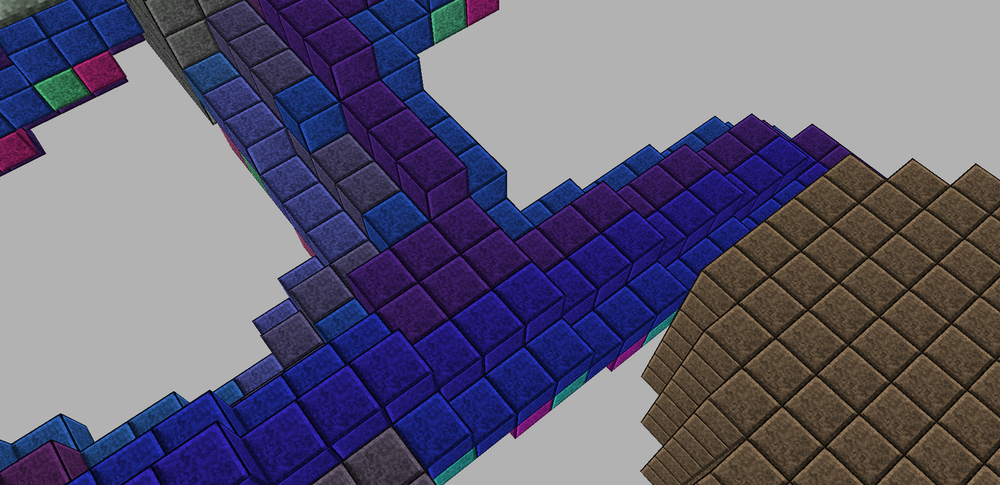

# 3DRoguelike

## How to build

### Disclaimer
- Originally, application was developed using Visual Studio 2022 (with CMake project) on Windows 10. 
- vcpkg was used as a package manager
- Other OS (Linux, Mac) were not tested, but in theory, code should be cross-platform.
### Steps
- `git clone --recurse-submodules https://github.com/asmorodinov/3DRoguelike.git`
- Install dependencies via vcpkg, or other methods:
  - glm 0.9.9.8#2
  - glfw3 3.3.8#2
  - glad 0.1.36
  - spdlog 1.11.0
  - cgal 5.5.2
  - freetype 2.12.1#3
  - yaml-cpp 0.7.0#1
  - immer 0.8.0#1
  - boost 1.82.0#1
- Build project with Visual Studio 2022 or CMake.

## Level generation
- Algorithm is based on https://vazgriz.com/119/procedurally-generated-dungeons/
- However, algorithm was optimized - it uses `immer::set` instead of `std::unordered_set` as data strucuture for storing sets of previously visited nodes in pathfinding algorithm.
- Walls are placed differently - they are regular tiles (cubes), instead of "thin" walls.

## Rendering
OpenGL is used to render the scene, with the help of GLFW and GLAD C++ libraries. Most of the rendering code is based on the articles from https://learnopengl.com/

## Physics
- Player is represented as a sphere.
- Level is represented as a collection of AABB cubes (wall, floor and ceiling blocks), as well as 3D models consisting of triangles - stairs (stairs are represented as slope.obj model - which is a triangular prism).
- Swept collision detection is used.
- Code for player physics and movement (friction, gravity, jumps, etc) is based on https://github.com/obiwac/python-minecraft-clone/blob/master/episode-12/entity.py
- Additional effort was put in to handle stairs collisions properly: player does not slide down on stairs (due to gravity), player does not bounce when moving down.

## Assets used
- Font - [mago1](https://eng.fontke.com/font/166545108/detail/) Medium 001.000 (used for personal trial only).
- Textures - [dungeon-crawl-32x32-tiles](https://opengameart.org/content/dungeon-crawl-32x32-tiles).
- Shaders - [text.vs](https://learnopengl.com/code_viewer_gh.php?code=src/7.in_practice/2.text_rendering/text.vs), [text.fs](https://learnopengl.com/code_viewer_gh.php?code=src/7.in_practice/2.text_rendering/text.fs).

## Screenshots

### Normal level, size = 50x20x50, 10 rooms, 17 corridors, seed = 1236

#### Outside

#### Inside

### Rooms

#### Rectangular room
##### Outside

##### Inside

#### Oval (ellipsoid) room
##### Outside

##### Inside

#### Cylinder room
##### Outside

##### Inside

### Corridors

### Big level, size = 100x40x100, 10 rooms, 10 corridors, seed = 1236

